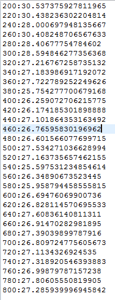
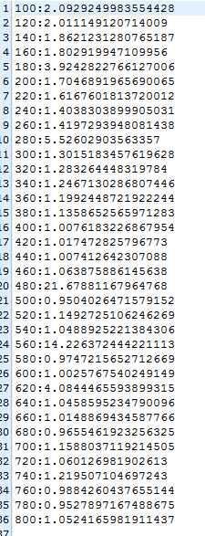
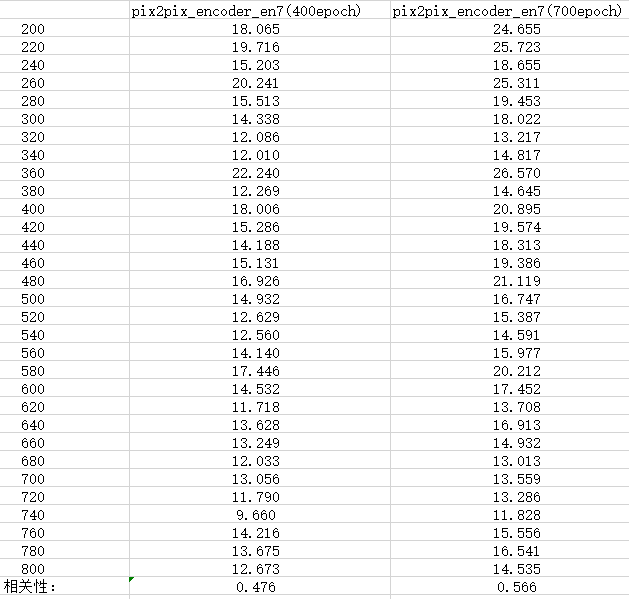
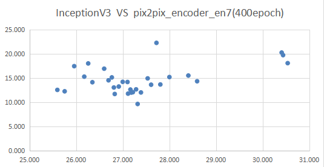
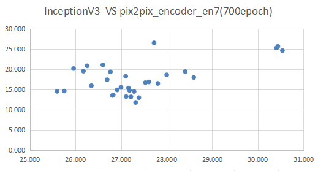

## 1.使用最原始的FID去计算pix2pix生成的sketch和ground_true_sketch之间的相似度



## 2.使用official的vggface去计算pix2pix生成的sketch和ground_true_sketch之间的相似度

在使用vggface的过程中我们提取的是fc6层出来的特征（bs×4096）,将其处理成（bs×4096×1×1）同时也分别测试了relu6,fc7,relu7出来的特征，但从结果上来分析发现relu这一激活函数会导致很多信息的丢失。另外还尝试了pool5出来的特征（bs×512×7×7），在原计算FID的代码中会使用adaptive_avg_pool2d将特征变成（bs×512×1×1），也会导致大量信息丢失。故而最终确定下来使用fc6层出来的特征。


## 3.使用微调过得vggface去计算FID

使用cufs数据集中train_sketch数据（size=268）去训练vggface，在训练的时候我们采用的是通过官方vggface模型参数来进行微调，learning rate设置为1e-7,在经过10000epoch之后acc稳定在90%。

接下来我们需要计算rank-k来对模型的进行挑选（这一步骤还不太明白该如何操作）


所以随机挑选一个微调过的vggface模型（10000.pth），提取其fc6层出来的特征对FID进行计算（pix2pix_test_gt_sketch和pix2pix_test_generator_sketch之间的FID）FID= 319043.5419


## 4.使用pix2pix模型去让sketch生成sketch

### 4.1

### 使用cufs数据集中train_sketch数据（size=268）去训练pix2pix，达到使用sketch去生成sketch的目的，为了挑选出好的模型，我们还是使用InceptionV3模型（原始FID计算方式），此时计算出的FID如下图所示。



​		从结果看发现有个别FID值出现奇怪的跳动，从1.+直接调到14.+。暂且我们挑选出来400epoch和700epoch的G模型，我们使用该G模型去替换InceptionV3模型去计算FID值（pix2pix_test_gt_sketch和pix2pix_test_generator_sketch之间的FID），pix2pix中的G模型结构为u-net 结构，我们将尝试在encoder中的out_en7层的输出作为计算FID是的feature，



为了观察在section1 中原始FID（使用InceptionV3抽取feature）和本部分计算的FID（抽取pix2pix中encoder_en7的特征）的相关程度 我们画了散点图，如下图所示。





4.2 而后我们修改了pix2pix模型，去掉了G网络中u-net的跳接这一步骤，

4.3 接着还尝试了u-net模型替换成VAE模型，详细代码如下。

```Python
class VAEEncoder(BaseNetwork):
    def __init__(self, in_c):
        super(VAEEncoder, self).__init__()
        kw = 3
        pw = int(np.ceil((kw - 1.0) / 2))
        ndf = 64
        ngf = 32
        # norm_layer = get_nonspade_norm_layer(opt, opt.norm_E)
        self.layer1 = nn.Sequential(
            nn.Conv2d(in_c, ndf, kw, stride=2, padding=pw),
            nn.BatchNorm2d(ndf)
        )
        self.layer2 = nn.Sequential(
            nn.Conv2d(ndf * 1, ndf * 2, kw, stride=2, padding=pw),
            nn.BatchNorm2d(ndf * 2)
        )
        self.layer3 = nn.Sequential(
            nn.Conv2d(ndf * 2, ndf * 4, kw, stride=2, padding=pw),
            nn.BatchNorm2d(ndf * 4)
        )
        self.layer4 = nn.Sequential(
            nn.Conv2d(ndf * 4, ndf * 8, kw, stride=2, padding=pw),
            nn.BatchNorm2d(ndf * 8)
        )
        self.layer5 = nn.Sequential(
            nn.Conv2d(ndf * 8, ndf * 8, kw, stride=2, padding=pw),
            nn.BatchNorm2d(ndf * 8)
        )
        self.layer6 = nn.Sequential(
            nn.Conv2d(ndf * 8, ndf * 8, kw, stride=2, padding=pw),
            nn.BatchNorm2d(ndf * 8)
        )
        self.so = s0 = 4
        self.fc_mu = nn.Linear(ndf * 8 * s0 * s0, 256)
        self.fc_var = nn.Linear(ndf * 8 * s0 * s0, 256)
        self.actvn = nn.LeakyReLU(0.2, False)
        # self.opt = opt
        self.de1 = nn.Sequential(
            nn.ConvTranspose2d(ngf * 8, ngf * 8, kernel_size=4, stride=2, padding=1),
            nn.BatchNorm2d(ngf * 8),
            # nn.Dropout(0.5),
            nn.ReLU(True)
        )
        self.de2 = nn.Sequential(
            nn.ConvTranspose2d(ngf * 8, ngf * 8, kernel_size=4, stride=2, padding=1),
            nn.BatchNorm2d(ngf * 8),
            nn.Dropout(0.5),
            nn.ReLU(True)
        )
        self.de3 = nn.Sequential(
            nn.ConvTranspose2d(ngf * 8, ngf * 8, kernel_size=4, stride=2, padding=1),
            nn.BatchNorm2d(ngf * 8),
            nn.Dropout(0.5),
            nn.ReLU(True)
        )
        self.de4 = nn.Sequential(
            nn.ConvTranspose2d(ngf * 8, ngf * 8, kernel_size=4, stride=2, padding=1),
            nn.BatchNorm2d(ngf * 8),
            nn.Dropout(0.5),
            nn.ReLU(True)
        )
        self.de5 = nn.Sequential(
            nn.ConvTranspose2d(ngf * 8, ngf * 4, kernel_size=4, stride=2, padding=1),
            nn.BatchNorm2d(ngf * 4),
            nn.ReLU(True)
        )
        self.de6 = nn.Sequential(
            nn.ConvTranspose2d(ngf * 4, ngf * 2, kernel_size=4, stride=2, padding=1),
            nn.BatchNorm2d(ngf * 2),
            nn.ReLU(True)
        )
        self.de7 = nn.Sequential(
            nn.ConvTranspose2d(ngf * 2, ngf, kernel_size=4, stride=2, padding=1),
            nn.BatchNorm2d(ngf),
            nn.ReLU(True)
        )
        self.de8 = nn.Sequential(
            nn.ConvTranspose2d(ngf, 3,
                               kernel_size=4, stride=2,
                               padding=1),
            nn.Tanh()
        )
    def forward(self, x):
        if x.size(2) != 256 or x.size(3) != 256:
            x = F.interpolate(x, size=(256, 256), mode='bilinear')
        x = self.layer1(x)
        x = self.layer2(self.actvn(x))
        x = self.layer3(self.actvn(x))
        x = self.layer4(self.actvn(x))
        x = self.layer5(self.actvn(x))
        x = self.layer6(self.actvn(x))
        x = self.actvn(x)
        x = x.view(x.size(0), -1)
        mu = self.fc_mu(x)  # mu :1*256
        logvar = self.fc_var(x)  # logvar: 1*256
        vae_result = reparameterize(mu, logvar)  # result : 1*256
        x = vae_result.view(vae_result.shape[0], -1, 1, 1)
        out_de1 = self.de1(x)
        out_de2 = self.de2(out_de1)
        out_de3 = self.de3(out_de2)
        out_de4 = self.de4(out_de3)
        out_de5 = self.de5(out_de4)
        out_de6 = self.de6(out_de5)
        out_de7 = self.de7(out_de6)
        out_de8 = self.de8(out_de7)
        return out_de8
```


